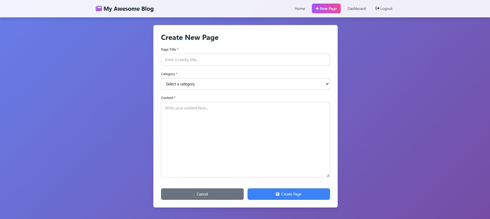
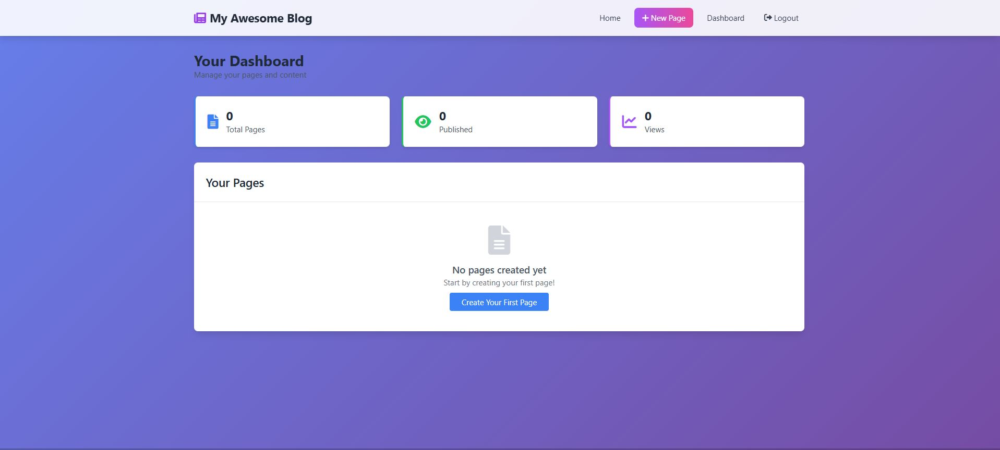
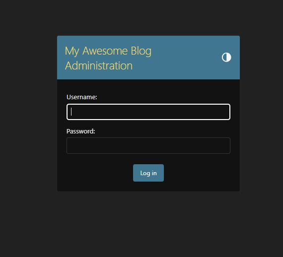

**My Awesome Blog - Personal Content Management System**

A beautiful, modern blogging platform built with Django and Tailwind CSS. Perfect for personal blogging, journaling, and sharing your stories with the world.

🚀 Features
✨ Modern UI: Beautiful gradient design with glass-morphism effects

📱 Responsive Design: Perfect on desktop, tablet, and mobile

🗂️ Category Management: Organize posts into custom categories

🔐 User Authentication: Secure login/logout system

📊 Personal Dashboard: Manage your blog posts easily

🎨 Beautiful Typography: Optimized reading experience

⚡ Fast Performance: Lightweight and efficient

**Screen shots:**

🛠️ Installation Guide
Step 1: Setup Environment

# Navigate to project directory
cd my-awesome-blog

# Create virtual environment
python -m venv venv

# Activate virtual environment
# Windows:
venv\Scripts\activate
# Mac/Linux:
source venv/bin/activate

# Install Django
pip install Django
Step 2: Database Setup

# Create database tables
python manage.py makemigrations
python manage.py migrate

# Create your admin account
python manage.py createsuperuser
Step 3: Launch Your Blog

# Start the development server
python manage.py runserver
Visit your blog: http://127.0.0.1:8000/

👤 Admin Access
Admin Panel: http://127.0.0.1:8000/admin/

Dashboard: http://127.0.0.1:8000/dashboard/

📖 Quick Start

1. First Login
Go to http://127.0.0.1:8000/admin/

Login with your superuser credentials

You're now ready to start blogging!

2. Create Categories
   
In admin panel, click "Categorys"

Click "ADD CATEGORY"

Add categories like: "Personal Stories", "Travel", "Technology", etc.

Save each category

3. Write Your First Post
   
Click "New Page" in the navigation

Fill in your post details:

Title: Catchy title for your story

Category: Choose relevant category

Content: Write your amazing content

Click "Create Page"

🎨 Customization
Change Blog Name
Edit cms_app/templates/cms_app/base.html:

html
<!-- Change "My Awesome Blog" to your preferred name -->
Modify Colors
Edit the gradient in base.html:

css
background: linear-gradient(135deg, #667eea 0%, #764ba2 100%);
📱 Using Your Blog

For Blog Readers
Homepage: Browse all published posts

Categories: Filter posts by category using left sidebar

Reading: Click "Read More" on any post to read full content

For You (Blog Owner)

New Post: Click "New Page" to create content

Dashboard: View and manage all your posts

Admin Panel: Advanced content management

🔧 Troubleshooting
Common Issues
"Categories dropdown is empty"

# Solution: Create categories first
1. Go to Admin Panel → Categorys
2. Add at least one category
"Server not starting"

# Try different port
python manage.py runserver 8001
"Login issues"
Clear browser cache (Ctrl+Shift+Delete)

Use incognito mode

Verify username/password

🚀 Deployment Ready
Your blog is production-ready! For going live:

Set DEBUG = False in settings.py

Configure proper database (PostgreSQL recommended)

Set up web server (Nginx + Gunicorn)

Configure domain and SSL

Start sharing your stories with the world! 🌟

   My Awesome Blog - Where your stories come to life.